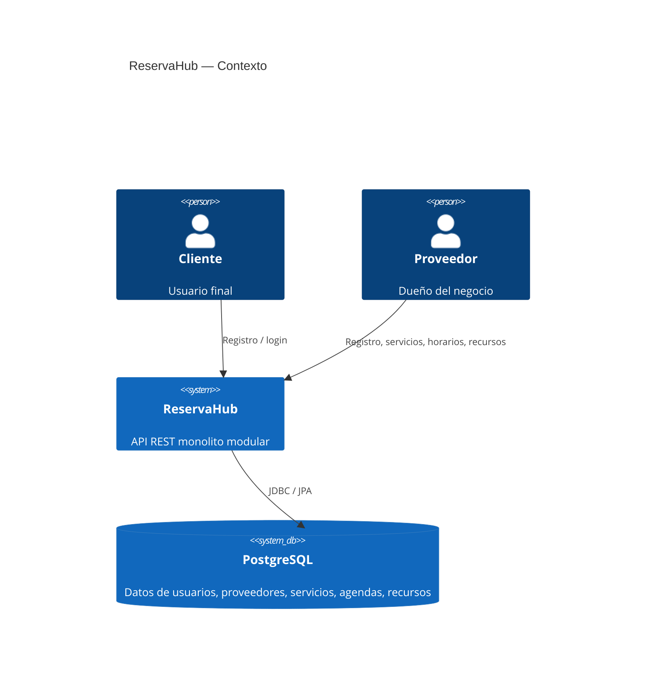
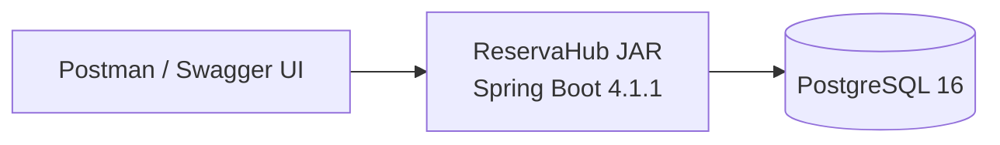
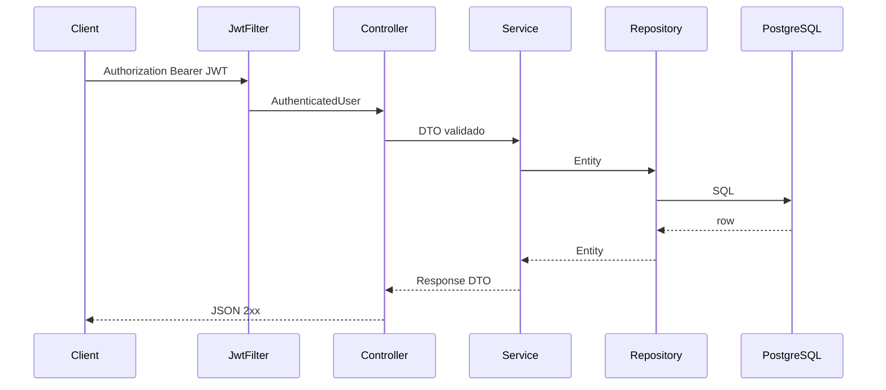
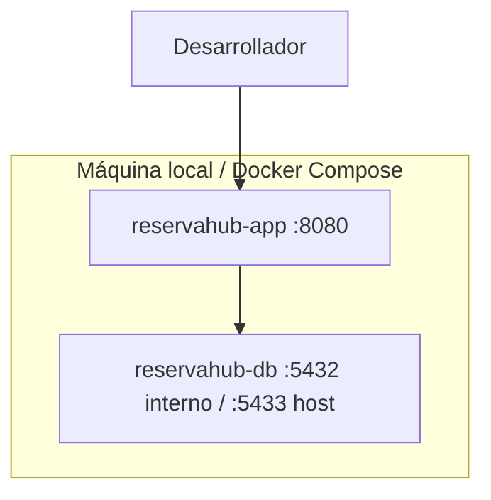

# Diagramas de arquitectura (C4 ligero / UML textual)

Los diagramas reflejan **solo** componentes implementados en Sprint 1.

## Diagrama de contexto



## Diagrama de contenedores



## Diagrama de paquetes

```text
co.udea.codefactory.reservahub
├── user
├── provider
├── servicecatalog
├── schedule
├── resource
├── reservation   (placeholder)
├── report        (placeholder)
├── security
├── audit
├── observability
└── shared
```

## Diagrama de componentes (request autenticada de proveedor)



## Diagrama de despliegue


